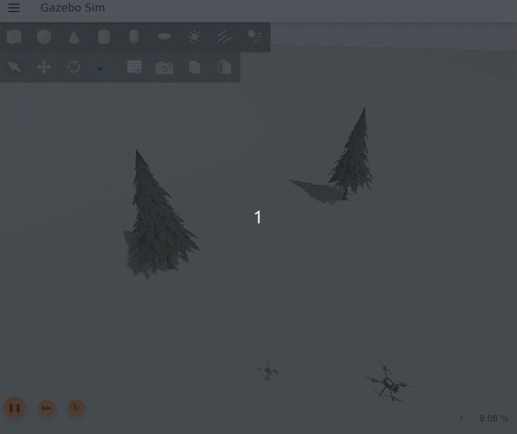

# 🚁 PX4 ROS2 LiDAR Obstacle Avoidance

## 📌 Project Overview

This project implements a **ROS2 (Python) + PX4 offboard control + Gazebo LiDAR obstacle avoidance pipeline** for autonomous drone simulation.

It extends a waypoint-based PX4 offboard autonomy foundation with **LiDAR-based reactive avoidance**, allowing the drone to:

* take off autonomously
* follow waypoint missions
* detect obstacles using a 2D LiDAR sensor
* perform local avoidance maneuvers
* resume the mission after bypassing obstacles
* land autonomously

The system is designed with a modular robotics architecture: low-level PX4 flight control is separated from high-level mission logic, LiDAR processing, obstacle detection, and avoidance behavior. This makes the project easier to understand, test, and extend for future work in local planning, mapping, and perception-driven autonomy.

---

## 🎥 Demo

### Autonomous mission + LiDAR obstacle avoidance



---

## ✨ Features

* ✅ PX4 SITL + ROS2 integration using Micro XRCE-DDS
* ✅ Offboard control via ROS2 Python
* ✅ Autonomous waypoint mission execution
* ✅ Gazebo LiDAR sensor integrated with PX4 simulation
* ✅ Gazebo → ROS2 LiDAR bridging using `ros_gz_bridge`
* ✅ LiDAR sector-based distance processing
* ✅ Front obstacle detection using configurable distance threshold
* ✅ Preferred avoidance direction selection using left/right clearance
* ✅ Direction-aware obstacle avoidance using mission forward vector
* ✅ Mission-aligned yaw control toward the next waypoint
* ✅ Frozen yaw during avoidance for stable lateral bypass
* ✅ Multi-step avoidance behavior:

  * sidestep
  * forward bypass
  * return to mission
* ✅ Modular node-based ROS2 architecture
* ✅ YAML-based parameter configuration
* ✅ Single launch workflow for mission + bridge + avoidance stack

---

## 🧠 System Architecture

The project is composed of four main layers:

### 1. Flight control layer

Handles low-level PX4 communication and trajectory setpoint publishing.

* **`offboard_control.py`**

  * PX4 offboard heartbeat
  * trajectory setpoint publishing
  * arm / mode switching / landing commands
  * receives final mission position + yaw targets from higher-level nodes

### 2. Mission layer

Handles nominal autonomous mission execution.

* **`mission_manager.py`**

  * high-level mission state machine
  * takeoff
  * waypoint sequencing
  * landing request
  * computes desired yaw toward the current mission waypoint

### 3. LiDAR perception layer

Processes scan data into safety-relevant information.

* **`lidar_processor.py`**

  * subscribes to ROS2 LiDAR scan topic
  * computes sector-based minimum distances:

    * front
    * left
    * right

* **`obstacle_detector.py`**

  * evaluates front clearance
  * detects obstacles using a configurable threshold
  * selects preferred avoidance direction based on side clearance

### 4. Avoidance behavior layer

Overrides the mission target temporarily when an obstacle is detected.

* **`avoidance_manager.py`**

  * passes through mission targets in normal operation
  * freezes yaw when avoidance starts
  * computes sidestep target using the mission forward unit vector
  * computes a forward bypass target
  * returns control to the mission after obstacle bypass

---

## 🔁 Data Flow

```mermaid
flowchart LR
    MM[mission_manager.py<br/>Mission logic + yaw generation]
    AM[avoidance_manager.py<br/>Behavior arbitration + avoidance]
    OC[offboard_control.py<br/>PX4 interface]
    PX4[PX4 SITL Autopilot]
    GZ[Gazebo Simulation]

    LIDAR[Gazebo LiDAR Sensor]
    BR[ros_gz_bridge]
    LP[lidar_processor.py]
    OD[obstacle_detector.py]

    MM -- /mission/desired_target --> AM
    MM -- /mission/desired_yaw --> AM
    MM -- /mission/land --> OC

    OC -- /mission/current_position --> MM
    OC -- /mission/current_position --> AM

    LP -- /avoidance/front_distance --> OD
    LP -- /avoidance/left_distance --> OD
    LP -- /avoidance/right_distance --> OD

    OD -- /avoidance/obstacle_detected --> AM
    OD -- /avoidance/preferred_direction --> AM

    AM -- /mission/target_position --> OC
    AM -- /mission/target_yaw --> OC

    OC -- /fmu/in/offboard_control_mode --> PX4
    OC -- /fmu/in/trajectory_setpoint --> PX4
    OC -- /fmu/in/vehicle_command --> PX4

    PX4 -- /fmu/out/vehicle_local_position --> OC
    PX4 -- /fmu/out/vehicle_status_v1 --> OC

    PX4 --- GZ
    GZ --> LIDAR
    LIDAR --> BR
    BR --> LP
```



---

## ⚙️ Dependencies

* ROS2 Humble
* PX4 Autopilot (SITL, v1.16.0 recommended)
* Gazebo Harmonic / `gz`
* Micro XRCE-DDS Agent
* QGroundControl
* `px4_msgs`
* `ros_gz_bridge`
* `sensor_msgs`
* `geometry_msgs`
* `std_msgs`

---

## 🚀 How to Run

### 1. Source environment

```bash
source ~/drone_ws/env_px4.sh
```

Example environment script:

```bash
source ~/drone_ws/install/setup.bash
export ROS_DOMAIN_ID=0
unset ROS_LOCALHOST_ONLY
```

---

### 2. Start Micro XRCE-DDS Agent

```bash
MicroXRCEAgent udp4 -p 8888
```

---

### 3. Start QGroundControl

```bash
./QGroundControl.AppImage
```

---

### 4. Start PX4 SITL with LiDAR model

```bash
cd ~/PX4-Autopilot
make px4_sitl gz_x500_lidar_2d
```

---

### 5. Launch the full mission + avoidance stack

```bash
ros2 launch drone_lidar_avoidance_py mission_with_avoidance.launch.py
```

This launch file starts:

* LiDAR bridge (`ros_gz_bridge`)
* `offboard_control.py`
* `mission_manager.py`
* `lidar_processor.py`
* `obstacle_detector.py`
* `avoidance_manager.py`

---

## 🗺️ Mission Configuration

Mission parameters are defined in YAML files under:

```text
config/
```

Example:

```yaml
mission_manager_node:
  ros__parameters:
    takeoff_altitude: -2.0
    position_tolerance: 0.5
    hold_count_required: 10
    waypoints: [0.0, 0.0, -2.0, 10.0, 0.0, -2.0, 5.0, 5.0, -2.0, 0.0, 2.0, -2.0]
```

### Waypoint Format

Waypoints are defined in **PX4 local NED frame**:

```text
[x1, y1, z1, x2, y2, z2, ...]
```

Each group of 3 values represents one waypoint.

* `x` → North
* `y` → East
* `z` → Down (negative = altitude above origin)

---

## 🔧 Key Parameters

### `offboard_params.yaml`

```yaml
offboard_control_node:
  ros__parameters:
    default_target_x: 0.0
    default_target_y: 0.0
    default_target_z: -2.0
    target_yaw: 0.0
    setpoint_rate_hz: 10.0
```

### `mission_params.yaml`

```yaml
mission_manager_node:
  ros__parameters:
    takeoff_altitude: -2.0
    position_tolerance: 0.5
    hold_count_required: 10
    waypoints: [0.0, 0.0, -2.0, 10.0, 0.0, -2.0, 5.0, 5.0, -2.0, 0.0, 2.0, -2.0]
```

### Launch-time avoidance tuning

The working launch configuration used in testing included:

* `obstacle_distance_threshold = 4.0`
* `avoidance_offset = 4.0`
* `obstacle_detector_node log_rate_hz = 20.0`
* `avoidance_manager_node timer_rate_hz = 20.0`

These values gave stable avoidance performance in the tested simulation scenarios.

---

## 🚧 Avoidance Behavior

The current system implements a **reactive local avoidance strategy**.

### Avoidance sequence

1. Follow mission target normally
2. Detect obstacle in the LiDAR front sector
3. Choose preferred direction using left/right clearance
4. Freeze current yaw
5. Perform lateral sidestep relative to the mission forward direction
6. Move forward past the obstacle while staying offset
7. Return to normal mission following

### Why yaw is frozen during avoidance

During avoidance, the drone keeps its current heading instead of rotating toward the temporary avoidance target. This keeps the LiDAR front/left/right interpretation stable and makes the lateral bypass more predictable.

---

## 📁 Project Structure

```text
drone_lidar_avoidance_py/
├── config/
│   ├── offboard_params.yaml
│   └── mission_params.yaml
├── launch/
│   └── mission_with_avoidance.launch.py
├── docs/
│   └── lidar_avoidance_demo.gif
├── drone_lidar_avoidance_py/
│   ├── offboard_control.py
│   ├── mission_manager.py
│   ├── lidar_processor.py
│   ├── obstacle_detector.py
│   └── avoidance_manager.py
├── package.xml
├── setup.py
└── README.md
```

---

## 🔧 Key Concepts Demonstrated

* ROS2 publishers, subscribers, timers, and launch files
* PX4 offboard control through ROS2
* PX4 local NED frame waypoint missions
* Gazebo LiDAR sensor integration
* `ros_gz_bridge` usage for LiDAR transport
* LiDAR sector-based scan processing
* obstacle detection from range data
* behavior arbitration between mission-following and safety override
* mission-aligned yaw computation
* direction-aware lateral avoidance using forward unit vectors
* modular robotics software architecture

---

## 🚧 Current Limitations

* avoidance is reactive and local, not a full global planner
* no mapping or obstacle memory is used
* no SLAM or occupancy grid is included
* obstacle reasoning is based on front/left/right sectors only
* performance depends on threshold tuning, avoidance offset, and vehicle speed
* current avoidance behavior is designed for forward-flight waypoint missions rather than full omnidirectional collision prevention

---

## 🚀 Future Work

Planned next steps for this project:

* add a dedicated return-to-path / return-line state
* improve obstacle detector by separating decision rate from log rate
* publish richer avoidance status topics for debugging and visualization
* add RViz visualization for LiDAR sectors and avoidance targets
* support more complex environments and denser obstacle fields
* experiment with 3D LiDAR or point cloud processing
* integrate local mapping or occupancy-grid-based planning
* extend toward mission-aware local planning rather than purely reactive bypass

---

## 🏁 Summary

This project demonstrates a complete **PX4 + ROS2 LiDAR obstacle avoidance pipeline** in simulation, combining:

* autonomous waypoint flight
* LiDAR sensor integration
* Gazebo-to-ROS2 scan bridging
* sector-based obstacle detection
* mission-aware local avoidance
* multi-step bypass behavior
* autonomous mission resume after avoidance

It serves as a strong foundation for future work in local planning, mapping, autonomous navigation, and perception-driven drone behavior.
